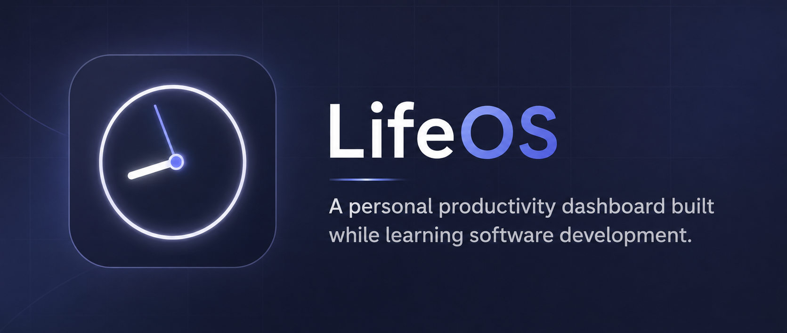

#  LifeOS

> **A personal productivity dashboard built while learning software development.**

<p align="center">
  
</p>

LifeOS is a web app that brings **tasks, habits, notes, and personal finance** into one place.

I built LifeOS primarily as a **learning-by-building project** — exploring how a frontend, backend, APIs, authentication, and a database work together in a real application.

##  Features

*  **Tasks** — Create, complete, and delete tasks
*  **Habits** — Track habits and their frequency
*  **Notes** — Create, edit, and delete notes
*  **Finance** — Record and manage financial entries
*  **Authentication** — User registration and login
*  **User-specific data** — Each user's data is separated

## Built With

**Frontend**

* HTML
* CSS
* JavaScript
* Jinja2

**Backend**

* Python
* FastAPI
* Pydantic

**Database**

* Supabase / PostgreSQL

##  Architecture

```text
Frontend
   │
   │ HTTP Requests
   ▼
FastAPI Backend
   │
   │ Supabase API
   ▼
Supabase / PostgreSQL
```

The frontend communicates with the FastAPI backend, which handles application logic and communicates with Supabase for data storage.

##  Running Locally

### 1. Clone the repository

```bash
git clone https://github.com/krishna12q/LifeOS.git
cd LifeOS
```

### 2. Install dependencies

```bash
pip install fastapi uvicorn supabase python-dotenv jinja2 python-multipart
```

### 3. Add environment variables

Create a `.env` file:

```env
SUPABASE_URL=your_supabase_url
SUPABASE_KEY=your_supabase_key
```

### 4. Run the application

```bash
uvicorn main:app --reload
```

Open the local URL provided by FastAPI in your browser.

##  What I Learned

LifeOS helped me explore:

* Python backend development
* FastAPI
* REST APIs
* Supabase and databases
* Authentication
* CRUD operations
* Frontend development
* Connecting frontend and backend
* Debugging real-world problems
* Basic web application architecture

## Project Status

**Completed as a learning project.**

LifeOS may receive future updates when there's something new I want to experiment with or learn.

##  Why LifeOS?

The goal wasn't to build a perfect productivity app.

The goal was to **learn by actually building something**.

Instead of only following tutorials, I wanted to take an idea, turn it into a working application, run into problems, debug them, and understand how the different pieces of software fit together.

---

**LifeOS — Build. Break. Learn. Improve.**
